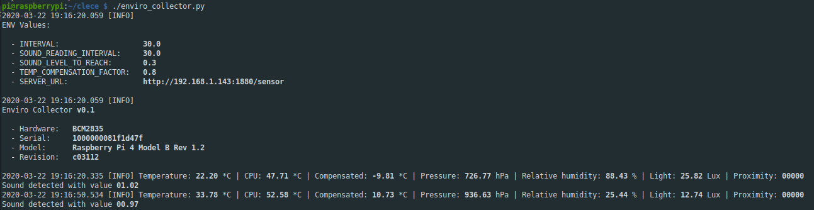

# enviro-collector
Data collector for Enviro phat on RaspberryPi

* [Description](#description)
* [Running the collector](#running-the-collector)
  + [Just run the code](#just-run-the-code)
  + [Using Docker](#using-docker)
* [Environment Variables](#environment-variables)
* [Data Sent Format](#data-sent-format)
* [Data Logged](#data-logged)
* [ChangeLog](./docs/CHANGELOG.md)

## Description
This projects allows to collect data from a Raspberry Pi armed with a [Enviro sensor phat], send that data to a server in a `json` HTTP POST request.

There are two versions of the Enviro phat; this code is built using the cheap version and sends data from this sensors:

* **Temperature** (from the temp sensor, the cpu temp sensor and a compensated temp using both values)
* **Pressure**
* **Light**
* **Humidity**

## Running the collector

### Just run the code

You can just clone the repo and run the code inside the [collector] folder right this:

```sh
./enviro_collector.py
```
You may set some environment variables before running it. See the [Environment Variables](#environment-variables) section.

### Using Docker

You can pull the docker image by running this command:

```sh
docker pull luixal/enviro-collector
```

or you can build the image yourself by just cloning the repo and running the `docker build` command:

```sh
docker build -t enviro-collector .
```

Once the image is ready, you can run it with a command like this:

```sh
docker run --name collector --privileged \
  --env SERVER_URL=http://my-node-red-server:1880/sensor \
  --env INTERVAL=5.5 \
  --env TEMP_COMPENSATION_FACTOR=1.5 \
  -d enviro-collector
```

Note that the `--privileged` option is mandatory so the container can access hardware (accessing GPIO is needed for using the Enviro phat).

## Environment Variables

As you can see in the docker section, we are passing some env config values. These are the env variables the container can accept and their default values:

| VARIABLE                 | DEFAULT VALUE                | DESCRIPTION                                                                 |
|--------------------------|------------------------------|-----------------------------------------------------------------------------|
| INTERVAL                 | 30.0                         | Time in seconds to wait between sensor readings                             |
| SOUND_READING_INTERVAL   | value given to INTERVAL      | Time in seconds to wait between sound readings                              |
| SOUND_LEVEL_TO_REACH     | 0.3                          | Sound threshold to reach to notify                                          |
| TEMP_COMPENSATION_FACTOR | 1.0                          | Factor to apply when compensating sensor temp reading with cpu temp reading |
| SERVER_URL               | http://localhost:1880/sensor | Server HTTP endpoint to send data                                           |
| HTTP_AUTH                |                              | HTTP Auth mechanism. Supported options: "basic" and "digest"                |
| HTTP_AUTH_USERNAME       |                              | HTTP Auth plain username                                                    |
| HTTP_AUTH_PASSWORD       |                              | HTTP Auth plain password                                                    |

## Data Sent Format
Collector sends data to an endpoint using an `HTTP POST` request. It includes a `device-id` header using Raspberry's device id as value.


Example:

```js
// Headers:
{
  host: '192.168.1.143:1880',
  connection: 'keep-alive',
  'accept-encoding': 'gzip, deflate',
  accept: '*/*',
  'user-agent': 'python-requests/2.21.0',
  'content-type': 'application/json',
  'x-device-id': '1000000081f1d47f',
  'content-length': '246'
}
// Body content:
{
  temperature: 22.200783591368236,
  light: 12.74215,
  proximity: 0,
  humidity: 25.79305445415391,
  pressure: 726.7723939614366,
  temperature_cpu: 51.121,
  temperature_compensated: -13.70598691942147,
  readAt: '2020-03-22 19:12:10.930484'
}
```

## Data Logged
Collector logs data to console output. When running with default variables you should see something similar to this:



[Enviro sensor phat]: https://shop.pimoroni.com/products/enviro?variant=31155658457171
